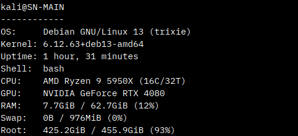
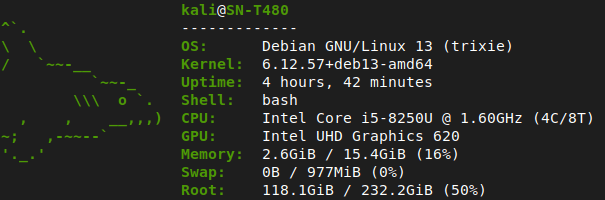
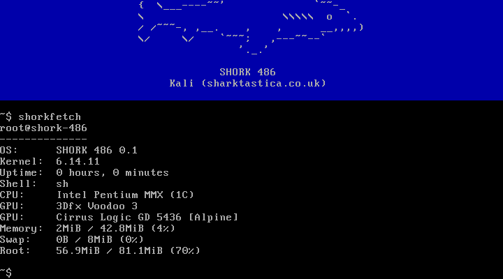
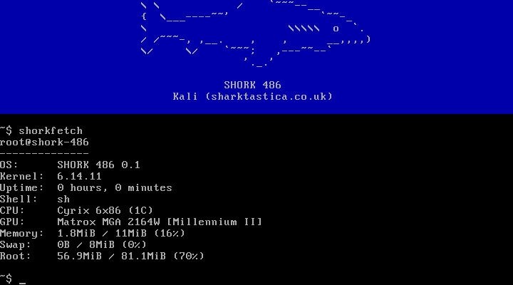
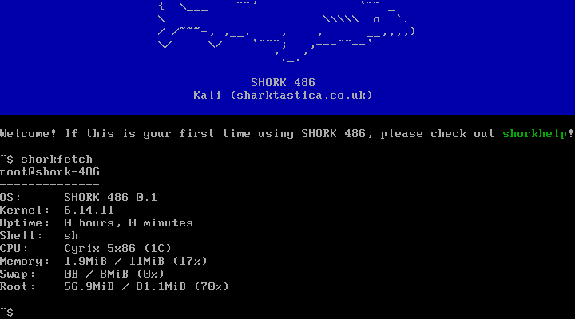
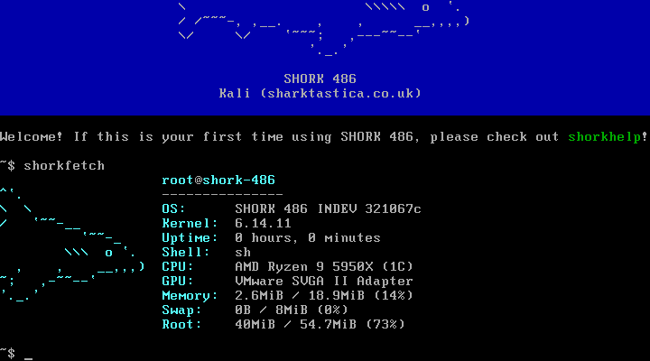

# shorkfetch

A SHORK utility for displaying basic system and environment information in a summarised format, similar to fastfetch, neofetch, etc. but without any art, graphics and perhaps with a limited amount of fields. It is primarily written for use with SHORK family operating systems like [SHORK 486](https://github.com/SharktasticA/SHORK-486), designed to be minimal, not taxing on 486-era hardware, and is statically linked. But it should work on modern Linux distributions just fine.

## Building

### Requirements

* C compiler (tested with GCC and i486-linux-musl-cross)
* `make`, `ar`, `ranlib` and `strip`

### Compilation

Simply run `make`.

### Installation

Run `make install` to install to `/usr/bin`. If you want to install it elsewhere, you can override the install location prefix like `make PREFIX=/usr/local install`.

## Screenshots

<table style="table-layout: fixed; width: 100%;">
  <tr>
    <td style="width: 50%; text-align: center;"></td>
    <td style="width: 50%; text-align: center;"></td>
  </tr>
  <tr>
    <td style="width: 50%;">Custom desktop running Debian 13</td>
    <td style="width: 50%;">Lenovo ThinkPad T480 running Debian 13</td>
  </tr>
</table>

<table style="table-layout: fixed; width: 100%;">
  <tr>
    <td style="width: 50%; text-align: center;"></td>
    <td style="width: 50%; text-align: center;"></td>
  </tr>
  <tr>
    <td style="width: 50%;">86Box emulating Intel Pentium MMX + 2 GPUs running SHORK 486</td>
    <td style="width: 50%;">86Box emulating Cyrix 6x86 + 1 GPU running SHORK 486</td>
  </tr>
</table>

<table style="table-layout: fixed; width: 100%;">
  <tr>
    <td style="width: 50%; text-align: center;"></td>
    <td style="width: 50%; text-align: center;"></td>
  </tr>
  <tr>
    <td style="width: 50%;">86Box emulating Cyrix 5x86 running SHORK 486</td>
    <td style="width: 50%;">VMware VM running SHORK 486</td>
  </tr>
</table>
