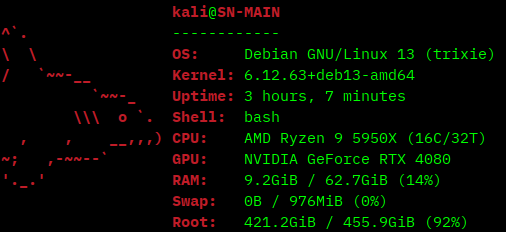
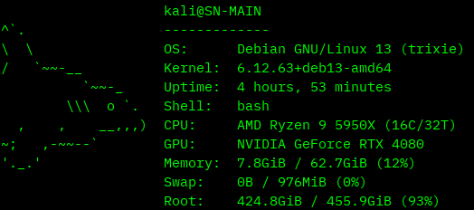
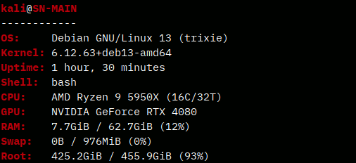
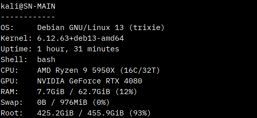
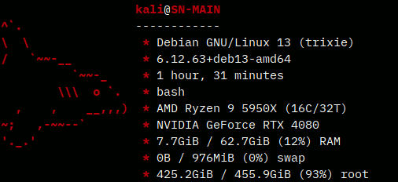
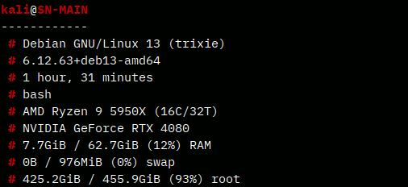
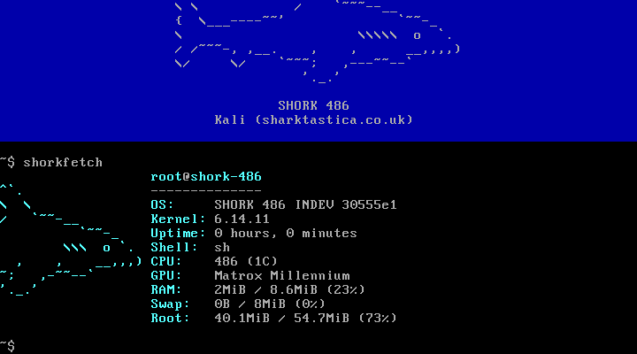

# shorkfetch

A Linux tool for displaying basic system and environment information in a summarised format. It is a *fetch clone (similar to neofetch, fastfetch, etc.) without complex or customisable art and less fields, but also significantly faster than most alternatives. It is primarily written for use with SHORK Operating Systems like [SHORK 486](https://github.com/SharktasticA/SHORK-486), designed suitable for use on a wide range of hardware going back to the 486 era. But it works on modern Linux systems just fine.

shorkfetch also has a focus on providing clean CPU and GPU name reporting, especially for vintage hardware and Intel integrated graphics. Data sources available for such *can* have too generic or 'messy' names, thus shorkfetch is designed to help address this.

## Building

### Requirements

You just need a C compiler (tested with GCC with either glibc or musl).

### Compilation

Simply run `make` to compile shorkfetch. There are some flags you can use individually or together to add styling to shorkfetch. Note that if you switch between compiling with or without any of the flags, you will need to run `make clean` before compiling again.

#### Custom colour accent

shorkfetch has an accent colour it uses for the ASCII art, field titles, the username and the hostname. You can compile with a specific accent colour by using the `COL` flag with one of the available colour names; for example, `make COL=MAGENTA`. `BOLD_CYAN` is the default and used as a fallback if a given colour name is invalid.

    BLACK           BLUE            CYAN            GREEN  
    MAGENTA         RED             WHITE           YELLOW
    GREY            BOLD_BLUE       BOLD_CYAN       BOLD_GREEN
    BOLD_MAGENTA    BOLD_RED        BOLD_WHITE      BOLD_YELLOW

Whilst the accent colour can be turned off when running with the `-nc`/`--no-col` argument, you can also permanently disable it by compiling with `COL=OFF` instead.

#### Disable ASCII art

shorkfetch has pre-programmed ASCII art normally intended for use with SHORK Operating Systems. Whilst this can be hidden when running with the `-na`/`--no-art` argument, you can also permanently disable it when compiling by using the `NO_ART` flag with any value assigned to it; for example, `make NO_ART=1`. 

### Installation

Run `make install` to install to `/usr/bin` (you may need `sudo` if not installing as root). If you want to install it elsewhere, you can override the install location prefix like `make PREFIX=/usr/local install`. You may include the `COL` and/or `NO_ART` flags as well.

## Running

Simply run `shorkfetch` to use.

### Arguments

* `-b`, `--bullets`: Uses bullet points instead of field headings; can also be used to set a custom character
* `-c`, `--compact`: Compacts field names (if not using bullets) and field values
* `-h`, `--help`: Shows help information and exits
* `-na`, `--no-art`: Disables the SHORK ASCII art (if compiled with art support)
* `-nc`, `--no-col`: Disables all coloured output (if compiled with colour support)

## Screenshots

<table style="table-layout: fixed; width: 100%;">
  <tr>
    <td style="width: 50%; text-align: center;"></td>
    <td style="width: 50%; text-align: center;"></td>
  </tr>
  <tr>
    <td style="width: 50%;">Custom PC running Debian 13 (+ ASCII art & accent colour)</td>
    <td style="width: 50%;">Custom PC running Debian 13 (+ ASCII art)</td>
  </tr>
  <tr>
    <td style="width: 50%; text-align: center;"></td>
    <td style="width: 50%; text-align: center;"></td>
  </tr>
  <tr>
    <td style="width: 50%;">Custom PC running Debian 13 (+ accent colour)</td>
    <td style="width: 50%;">Custom PC running Debian 13 (no customisation)</td>
  </tr>
</table>

<table style="table-layout: fixed; width: 100%;">
  <tr>
    <td style="width: 50%; text-align: center;"></td>
    <td style="width: 50%; text-align: center;"></td>
  </tr>
  <tr>
    <td style="width: 50%;">Custom PC running Debian 13 (+ ASCII art, accent colour & bullets)</td>
    <td style="width: 50%;">Custom PC running Debian 13 (+ accent colour & custom bullets)</td>
  </tr>
</table>

<table style="table-layout: fixed; width: 100%;">
  <tr>
    <td style="width: 50%; text-align: center;"></td>
  </tr>
  <tr>
    <td style="width: 50%;">86Box VM running SHORK 486</td>
  </tr>
</table>
