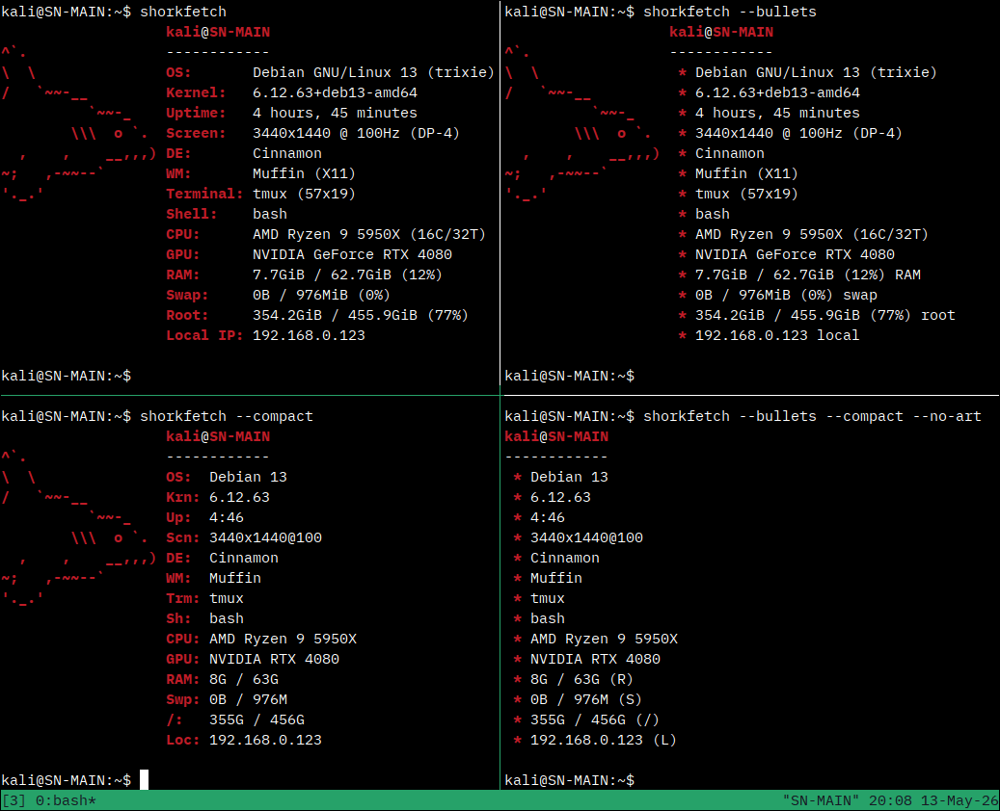
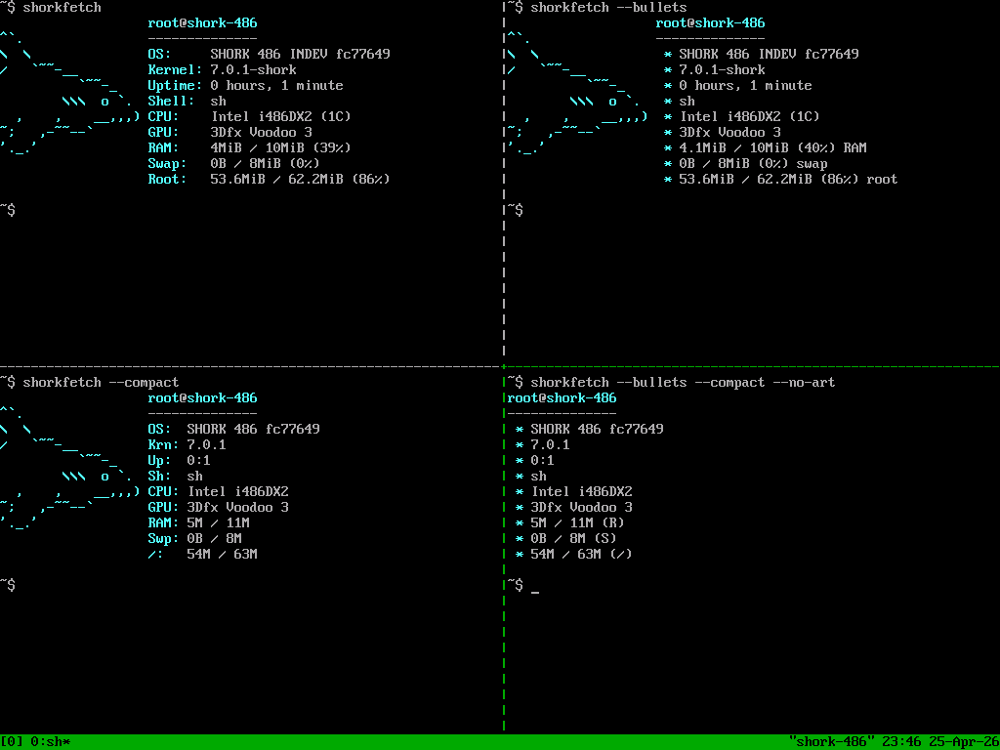
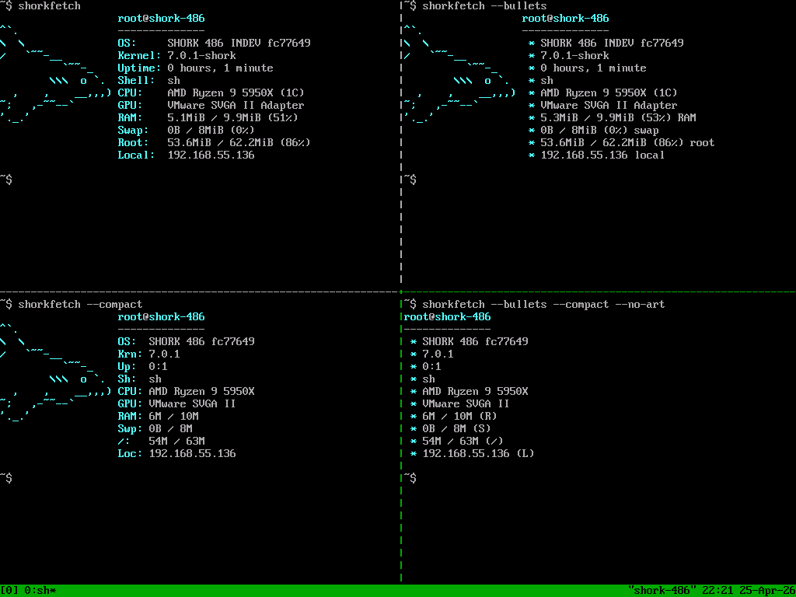

# shorkfetch

A cute shark-themed Linux fetch tool made with speed, consistent output, and vintage *and* modern hardware support in mind! It is similar to neofetch, fastfetch, etc., a little less comprehensive and less customisable, but often faster and provides cleaner output by default. It is primarily written for use with SHORK Operating Systems like [SHORK 486](https://github.com/SharktasticA/SHORK-486), designed for use on a wide range of hardware going back to the 486 era. But it works on modern Linux systems just fine.

SHORKFETCH also has a focus on providing clean CPU and GPU name reporting, especially for vintage hardware and Intel integrated graphics. Data sources available for such *can* have too generic or 'messy' names, thus SHORKFETCH is designed to help address this.

## Help wanted!

SHORKFETCH is young, and I would love to hear from you if you have tried SHORKFETCH and found that (in particular) the **DE, WM and/or GPU fields** were incorrect or imprecise, or in your opinion, were overly verbose, containing marks like "(R)", "TM", etc. and could likely be shortened without compromising understanding. Feel free to create an issue here or contact me via [email](https://sharktastica.co.uk/contact), Discord (@sharktastica) or Reddit (u/sharktastica), and I will take your feedback on board! Please include a screenshot of your SHORKFETCH's output, some context about your system's real specifications, and especially the following depending on the issue:

* CPU: `cat /proc/cpuinfo`
* DE/WM: `echo $XDG_CURRENT_DESKTOP`
* GPU: `lspci -nn | grep 0300`

## Building & installing

### Arch

SHORKFETCH is available on the [AUR](https://aur.archlinux.org/packages/shorkfetch).

    yay -S shorkfetch

### Nix

#### Run

    nix run github:SharktasticA/shorkfetch

#### Install

    nix profile install github:SharktasticA/shorkfetch

### Everything else

#### Requirements

You will need a C compiler, `make` and libc. SHORKFETCH is often tested with GCC + glibc or musl.

#### Quick/automated install

    curl -fsSL https://raw.githubusercontent.com/SharktasticA/shorkfetch/refs/heads/main/install.sh | bash

#### Manual install

Clone this repository by running `git clone https://github.com/SharktasticA/shorkfetch`, or downloading as a zip file and extracting it. When inside the new directory, run `make install` to install to `/usr/bin` (you may need `sudo` if not installing as root). If you want to install it elsewhere, you can override the install location prefix like `make PREFIX=/usr/local install` to install it to `/usr/local/bin`.

## Running

Usage: shorkfetch [OPTIONS]

### Options

* `-b`, `--bullet`: Specifies a custom character to use with bullet-point mode; no assignment returns the current character
* `-cl`, `--colour`: Specifies a custom accent colour; no assignment returns the current colour
* `-co`, `--compact`: Compacts field names and field values
* `-f`, `--fields`: Specifies a custom fields list and order; no assignment returns list of current fields
* `-h`, `--help`: Shows help information and exits
* `-m`, `--mode` : Select which view mode to use: [n]ormal, [b]ullets
* `-na`, `--no-art`: Disables the SHORK ASCII art
* `-r`, `--reset`: Resets to default, deletes configuration file and exits
* `-s`, `--save`: Saves chosen options to a configuration file
* `-v`, `--version`: Displays version number and exits

### Colours

Only one colour can be used at a time. "off" will use your system's/terminal emulator's text colour, and doesn't use ANSI escape codes (increasing compatibility with commands that change the output colour of another such as [gay](https://github.com/ms-jpq/gay)).

    black           blue            cyan            green  
    magenta         red             white           yellow
    grey            bold_blue       bold_cyan       bold_green
    bold_magenta    bold_red        bold_white      bold_yellow
    off

### Fields

These are possible field names you can use with the `--fields` argument. You enter then as a comma-separated list in double quotes. You can use any more than once and in any order, though there a maximum of 50 fields is presently supported.

* (single blank space): New line
* `---`: Category separator
* `os`: Operating system
* `krn`: Kernel
* `upt`: Uptime
* `pkgs`: Packages
* `scn`: Screen(s)
* `de`: Desktop environment
* `wm`: Window manager and/or Wayland compositor
* `trm`: Terminal emulator/console size
* `sh`: Shell
* `cpu`: CPU
* `gpu`: GPU(s)
* `ram`: System memory
* `swap`: Swap memory
* `root`: Root partition size
* `lip`: Local IP address
* `clrs`: ANSI escape code colour palette

### Configuration

When customising SHORKFETCH with the options above, you can use the `--save` option to store your choices in a configuration file. Subsequent saves will append the new options or replace existing ones. The configuration file (it is not recommended to modify this manually):

    ~/.config/shorkutils/shorkfetch.conf

To reset SHORKFETCH to its default configuration, simply run with the `--reset` option.

## Screenshots

### SHORKFETCH on real hardware + Debian 13

### SHORKFETCH on 86Box + SHORK 486

### SHORKFETCH on VMware Workstation + SHORK 486

