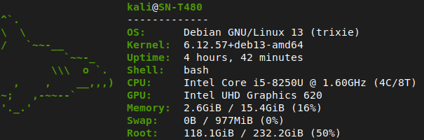
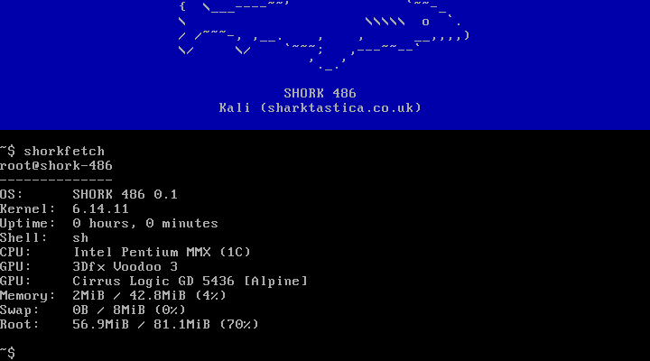
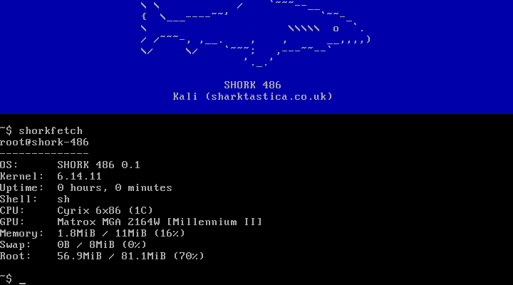
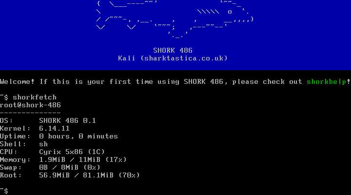
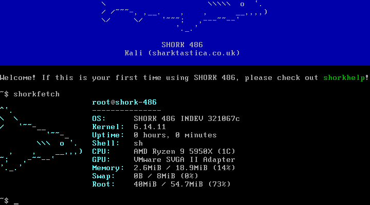

# shorkfetch

A lightweight Linux tool for displaying basic system and environment information in a summarised format, similar to fastfetch, neofetch, etc. but without any complex or customisable art and less fields, but also significantly faster. It is primarily written for use with SHORK Operating Systems like [SHORK 486](https://github.com/SharktasticA/SHORK-486), designed to be minimal and not taxing on 486-era hardware, and is statically linked. But it should work on modern Linux distributions just fine.

## Building

### Requirements

You just need a C compiler (tested with GCC with either glibc or musl).

### Compilation

Simply run `make` to compile shorkfetch. There are some flags you can use individually or together to add styling to shorkfetch. Note that if you switch between compiling with or without any of the flags, you will need to run `make clean` before compiling again.

#### With ASCII art

shorkfetch has pre-programmed ASCII art normally intended for use with SHORK Operating Systems. To enable it, add the `WITH_ART` flag with any value assigned to it; for example, `make WITH_ART=1`. 

#### With colour accent

shorkfetch can have an accent colour for headings and the optional ASCII art. To enable it, add the `WITH_COL` flag with one of the colour names before; for example, `make WITH_COL=MAGENTA`. If the given colour is invalid, `BOLD_CYAN` is used as the fallback.

    BLACK           BLUE            CYAN            GREEN  
    MAGENTA         RED             WHITE           YELLOW
    GREY            BOLD_BLUE       BOLD_CYAN       BOLD_GREEN
    BOLD_MAGENTA    BOLD_RED        BOLD_WHITE      BOLD_YELLOW

### Installation

Run `make install` to install to `/usr/bin` (you may need `sudo` if not installing as root). If you want to install it elsewhere, you can override the install location prefix like `make PREFIX=/usr/local install`. You may include the `WITH_ART` and/or `WITH_COL` flags as well.

## Running

Simply run `shorkfetch` to use.

### Arguments

* `-na`, `--no-art`: _If compiled with `WITH_ART` flag._ Allows you to hide the SHORK ASCII art for a single use.

* `-nc`, `--no-col`: _If compiled with `WITH_COL` flag._ Allows you to disable the accent colour for a single use. 

## Screenshots

<table style="table-layout: fixed; width: 100%;">
  <tr>
    <td style="width: 50%; text-align: center;"></td>
    <td style="width: 50%; text-align: center;"></td>
  </tr>
  <tr>
    <td style="width: 50%;">Custom desktop running Debian 13</td>
    <td style="width: 50%;">Lenovo ThinkPad T480 running Debian 13</td>
  </tr>
</table>

<table style="table-layout: fixed; width: 100%;">
  <tr>
    <td style="width: 50%; text-align: center;"></td>
    <td style="width: 50%; text-align: center;"></td>
  </tr>
  <tr>
    <td style="width: 50%;">86Box emulating Intel Pentium MMX + 2 GPUs running SHORK 486</td>
    <td style="width: 50%;">86Box emulating Cyrix 6x86 + 1 GPU running SHORK 486</td>
  </tr>
</table>

<table style="table-layout: fixed; width: 100%;">
  <tr>
    <td style="width: 50%; text-align: center;"></td>
    <td style="width: 50%; text-align: center;"></td>
  </tr>
  <tr>
    <td style="width: 50%;">86Box emulating Cyrix 5x86 running SHORK 486</td>
    <td style="width: 50%;">VMware VM running SHORK 486</td>
  </tr>
</table>
